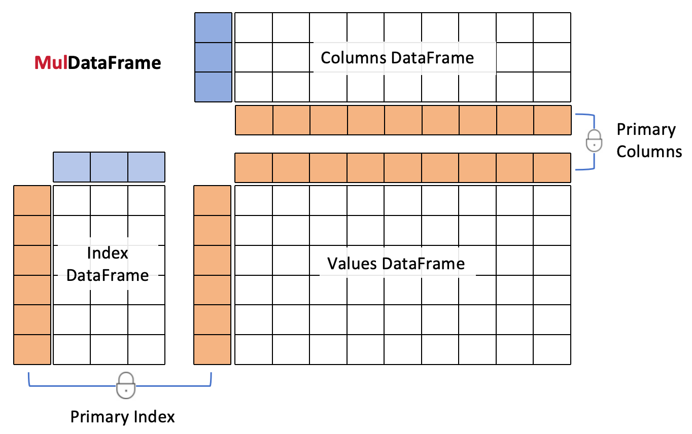

# MulDataFrame
### Towards a more intuitive multi-index DataFrame

*"A multi-index is just a DataFrame, period."*



Have you found the multi-index in pandas difficult to use? With unexpected behaviors? Do you want to get rid of the long and hard-to-remember methods like get_level_values() and pd.IndexSlice()? Have you wondered why the multi-index is so similar to a dataframe but is not one? Have you been confused with the difference between levels and columns?

If you answered yes to any of these questions, then MulDataFrame is right for you. MulDataFrame uses pandas dataframes as index and columns, which means you can manipulate them with all the familiar methods of a pandas dataframe and no more. 
### Installation
```shell
pip install muldataframe
```


### Introduction

A MulDataFrame object consists of three pandas dataframes: an index dataframe, a columns dataframe and a values dataframe. They are accessed through the `.index`, `.columns` and `.df` attributes of the muldataframe. The index of the index dataframe and the index of the columns dataframe are guaranteed to be the same as the index and the columns of the values dataframe. I'll call them the primary index and the primary columns.
```python
>>> import pandas as pd
>>> import muldataframe as md
>>> index = pd.DataFrame([[1,2],[3,6],[5,6]],
                     index=['a','b','b'],
                     columns=['x','y'])
>>> columns = pd.DataFrame([[5,7],[3,6]],
                    index=['c','d'],
                    columns=['f','g'])
>>> mf = MulDataFrame([[1,2],[8,9],[8,7]],
    index=index,columns=columns)
>>> mf
(3, 2)    g  7  6
          f  5  3
             c  d
--------  ---------
   x  y      c  d
a  1  2   a  1  2
b  3  6   b  8  9
b  5  6   b  8  7
````

Because of the primary index and columns, you can use `__getitem__`, `iloc` and `loc` on a muldataframe exactly as on its values dataframe, except that the return value is a muldataframe (or a mulseries) with its index and columns properly sliced. 

```python
>>> mf.primary_index
Index(['a', 'b', 'b'], dtype='object')
>>> mf.loc['b']
(2, 2)    g  7  6
          f  5  3
             c  d
--------  ---------
   x  y      c  d
b  3  6   b  8  9
b  5  6   b  8  7

```
MulDataFrame uses `.mloc` to perform multi-indexing. Its input can be a list or a dict. If a list is used, it is similar to the multi-indexing in pandas except that you don't need to create a `pd.IndexSlicer`. Just use a plain list with `...` as placeholders.
```python
>>> mf.mloc[[..., 6],[3]]
(2,)     g  6
         f  3
            d
-------  ------
   x  y     d
b  3  6  b  9
b  5  6  b  7
```
When dictionaries are used as indexers, you can change the order of [hierarchical indexing](https://pandas.pydata.org/docs/user_guide/advanced.html):

```python
# the result is a MulSeries object
>>> mf.mloc[{'y':[2,6],'x':3}]
(2,)     y  6
         x  3
            b
-------  ------
   f  g     b
c  5  7  c  8
d  3  6  d  9
```
In the above example, the muldataframe is first indexed using the `y` column of the index dataframe and then the `x` column. Using a list  as input cannot achieve this. In fact, `mf.mloc[[3,6]]` will report error.


`mf.mindex` and `mf.mcolumns`/`mf.mcols` are implemented as alias for `mf.index` and `mf.columns` to help distinguish between a multi-index and a regular index. `mf.pindex` and `mf.pcolumns`/`md.pcols` are implemented as alias for `mf.primary_index` and `mf.primary_columns` to shorten name length. We'll use these alias in the following examples.

```python
>>> mf.pcols
Index(['c', 'd'], dtype='object')
>>> mf.mindex
   x  y
a  1  2
b  3  6
b  5  6
```

Because of the locking of the primary index and columns, if you change the index of the index dataframe, the index of the values dataframe will also change. The same applies to the columns dataframe.
```python
>>> mf2 = mf.copy()
# mf2.pindex = ['d','e',5] also works
>>> mf2.index.index = ['d','e',5]
>>> mf2.df
	c	d
d	1	2
e	8	9
5	8	7
```

You can easily change the primary index to another column in the index dataframe by calling the `set_index()` method of the index dataframe like `md.index.set_index(col_name, inplace=True)`, where `md` is a muldataframe. 